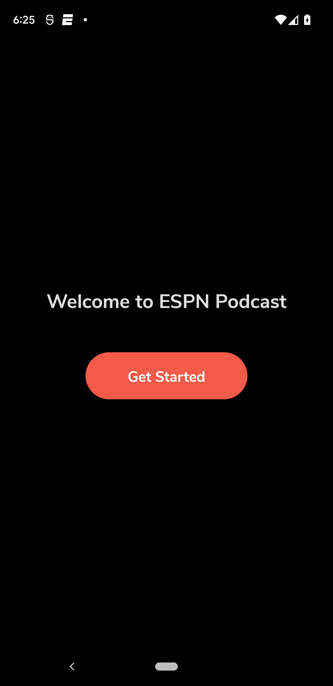
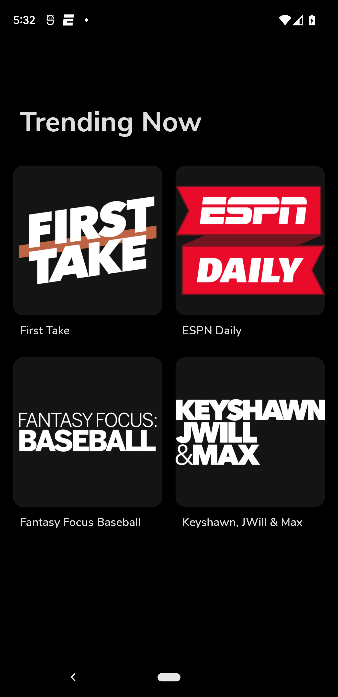
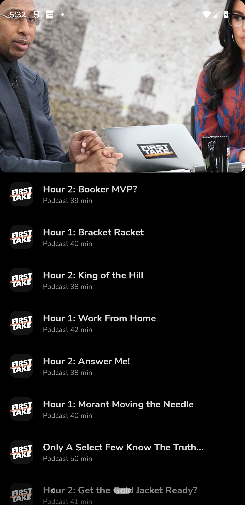
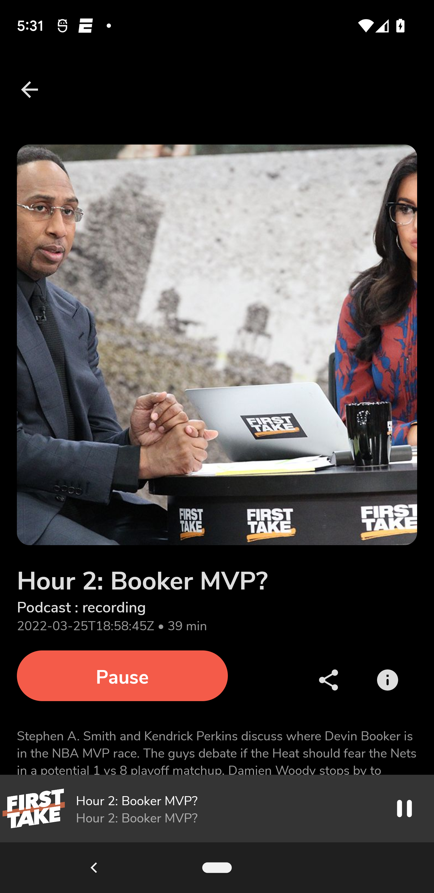
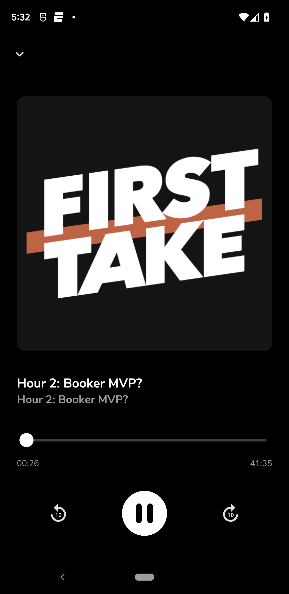

# ESPN Podcast App

ESPN podcast app made with Jetpack Compose and ExoPlayer.

## Features

- Jetpack Compose UI. Custom animations, transitions, light/dark theme, and layouts.
- Jetpack Compose Navigation.
- Dependency injection with Hilt.
- Retrieves podcasts metadata from the network.
- Allows background playback using a foreground service.
- Media style notifications.
- Uses a `MediaBrowserService` to control and expose the current media session.
- Controls the current playback state with actions such as: play/pause, skip to next/previous, shuffle, repeat and stop.
- Supports offline playback using `CacheDataSource` from `ExoPlayer`.
- Process images to find its color palette using Palette API.

## Libraries

- Jetpack Compose
- ExoPlayer
- Glide
- Hilt
- Retrofit
- Navigation
- ViewModel
- DataStore

## Result

### Dark Mode
|  |  | | | |
|----------|:-------------:|:-------------:|:-------------:|:-------------:|